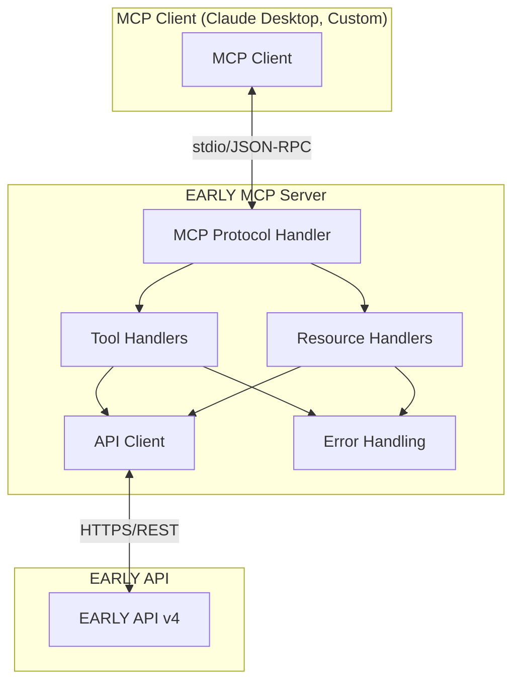

# Architecture

Technical architecture and design decisions for the EARLY MCP Server.

## Overview {#overview}

The EARLY MCP Server is designed as a bridge between the Model Context Protocol (MCP) specification and the EARLY app API, providing AI assistants with structured access to time tracking functionality.

## High-Level Architecture {#high-level}



## Core Components {#components}

### MCP Protocol Layer {#mcp-layer}

**File**: `src/index.ts`

The main server class that implements the MCP protocol specification.

#### Key Responsibilities
- **Protocol Compliance**: Implements MCP 2024-11-05 specification
- **Transport Handling**: Manages stdio communication with MCP clients
- **Request Routing**: Routes tool calls and resource reads to appropriate handlers
- **Error Management**: Provides consistent error responses

#### Architecture Decisions

**Transport: stdio**
- **Why**: MCP specification requirement for local integrations
- **Benefits**: Simple, secure, no network configuration required
- **Tradeoffs**: Limited to local connections only

**JSON-RPC 2.0**
- **Why**: MCP protocol standard
- **Benefits**: Well-established protocol, good tooling support
- **Implementation**: Each message is a single JSON line

### Tool Handler Architecture {#tool-handlers}

**Files**: `src/handlers/*.ts`

Modular architecture separating different types of operations.

```
handlers/
├── time-entry-handlers.ts    # CRUD operations for time entries
├── tracking-handlers.ts      # Timer start/stop operations  
├── activity-handlers.ts      # Activity management
└── resource-handlers.ts      # MCP resource providers
```

#### Design Principles

**Single Responsibility**
- Each handler focuses on one type of operation
- Clear separation between time entries, timers, and activities
- Resource handlers separate from tool handlers

**Consistent Interface**
```typescript
async function handleTool(
  apiClient: EarlyApiClient, 
  args: ToolArgs
): Promise<ToolResponse>
```

**Error Handling Pattern**
```typescript
try {
  checkApiCredentials();
  const result = await apiClient.operation(args);
  return formatSuccessResponse(result);
} catch (error) {
  return createToolErrorResponse(error, context);
}
```

### API Client Layer {#api-client}

**File**: `src/early-api-client.ts`

Abstraction layer over the EARLY API with comprehensive functionality.

#### Architecture Features

**Authentication Management**
```typescript
class EarlyApiClient {
  private accessToken: string | null = null;
  
  async authenticate(): Promise<void> {
    // API Key + Secret → Bearer Token
  }
  
  private async ensureAuthenticated(): Promise<void> {
    if (!this.accessToken) {
      await this.authenticate();
    }
  }
}
```

**HTTP Client Configuration**
- **Base URL**: Configurable via environment variables
- **Timeout**: 30 seconds default, configurable
- **Interceptors**: Request/response logging and error transformation
- **Headers**: Automatic authentication, content-type management

**Error Transformation**
```typescript
// Axios errors → Structured API errors
interface ApiError {
  code: string;
  message: string;
  details?: any;
}
```

#### API Endpoints Coverage

**Time Entries** (Full CRUD)
- `POST /api/v4/time-entries` - Create
- `GET /api/v4/time-entries/{id}` - Read
- `PATCH /api/v4/time-entries/{id}` - Update
- `DELETE /api/v4/time-entries/{id}` - Delete
- `GET /api/v4/time-entries/{start}/{end}` - Range query

**Timer Operations**
- `POST /api/v4/tracking/{activityId}/start` - Start timer
- `POST /api/v4/tracking/stop` - Stop timer
- `GET /api/v4/tracking` - Get current timer

**Activities**
- `GET /api/v4/activities` - List all activities

### Type System {#type-system}

**Files**: `src/types.ts`, `src/tool-types.ts`

Comprehensive TypeScript definitions ensuring type safety throughout the application.

#### Core Types

**Configuration**
```typescript
interface EarlyConfig {
  apiKey: string;
  apiSecret: string;
  baseUrl: string;
  timeout: number;
}
```

**API Entities**
```typescript
interface TimeEntry {
  id: string;
  activity?: Activity;
  duration: {
    startedAt: string;
    stoppedAt?: string;
  };
  note?: { text: string };
}

interface Activity {
  id: string;
  name: string;
}
```

**Tool Arguments**
```typescript
interface CreateTimeEntryArgs {
  projectId: string;        // Required
  description: string;      // Required
  startTime?: string;       // Optional
  endTime?: string;         // Optional
  duration?: number;        // Optional
}
```

#### Type Safety Benefits
- **Compile-time Validation**: Catches parameter mismatches
- **IDE Support**: Autocomplete and inline documentation
- **Refactoring Safety**: Changes propagate through type system
- **Documentation**: Types serve as living documentation

### Error Handling System {#error-handling}

**File**: `src/error-utils.ts`

Centralized error handling providing consistent user experience.

#### Error Categories

**Authentication Errors**
```typescript
// API credentials invalid or missing
return {
  content: [{
    type: 'text',
    text: 'Operation failed: Authentication failed\n\nDebug info:\n- API Key: Present\n- API Secret: Missing'
  }]
};
```

**Validation Errors**
```typescript
// Required parameters missing
if (!projectId) {
  throw new Error('Activity ID is required');
}
```

**API Errors**
```typescript
// EARLY API returns error
if (apiError.response?.status === 404) {
  return {
    content: [{
      type: 'text',
      text: 'Resource not found. The requested item may have been deleted.'
    }]
  };
}
```

#### Error Context
```typescript
interface ErrorContext {
  hasApiKey: boolean;
  hasApiSecret: boolean;
  baseUrl?: string;
  args?: any;
}
```

**Benefits:**
- **Debugging Information**: Always includes environment status
- **User-Friendly Messages**: Clear explanations over technical errors
- **Consistent Format**: Same error structure across all tools
- **Security**: No credential exposure in error messages

## Design Decisions {#design-decisions}

### MCP Protocol Version

**Choice**: MCP 2024-11-05
- **Reasoning**: Latest stable version with comprehensive tool support
- **Benefits**: Future compatibility, full feature set
- **Alternatives Considered**: Earlier versions lacked tool call features

### Authentication Strategy

**Choice**: EARLY API Key + Secret → Bearer Token
- **Reasoning**: EARLY API v4 requirement
- **Implementation**: Automatic token refresh, session management
- **Security**: Tokens stored in memory only, never logged

### Tool vs Resource Design

**Tools**: Interactive operations that modify state
- `create_time_entry`, `start_timer`, `stop_timer`
- Require parameters, return operation results
- Can have side effects

**Resources**: Read-only data access
- `early://time-entries/today`, `early://activities`
- No parameters, return structured data
- Cacheable, no side effects

### Error Response Format

**Choice**: Structured text responses with debug information
- **Reasoning**: Human-readable for Claude Desktop users
- **Benefits**: Clear troubleshooting guidance
- **Format**: Emoji indicators + explanation + debug context

### Modular Handler Architecture

**Choice**: Separate handler files by functionality
- **Benefits**: 
  - Easy to test individual components
  - Clear code organization
  - Simplified maintenance
  - Parallel development possible

**Alternative Considered**: Single large handler file
- **Rejected**: Would become unwieldy as functionality grows

## Performance Considerations {#performance}

### API Rate Limiting

**Strategy**: Respectful API usage
- **Implementation**: No aggressive caching (respects real-time data)
- **Consideration**: EARLY API rate limits unknown, designed for conservative usage
- **Future**: Could add intelligent caching for activity lists

### Memory Management

**Token Storage**: In-memory only
- **Benefits**: No persistent token storage security risks
- **Tradeoff**: Re-authentication required on server restart

**Request Caching**: Minimal
- **Choice**: Fresh data prioritized over performance
- **Reasoning**: Time tracking requires real-time accuracy

### Startup Time

**Optimization**: Lazy authentication
- **Implementation**: Authentication occurs on first API call
- **Benefit**: Faster server startup, better error handling
- **User Experience**: Immediate MCP availability

## Security Architecture {#security}

### Credential Management

**Storage**: Environment variables only
- **Benefits**: Not stored in code, not committed to version control
- **Access**: Only the server process can access credentials
- **Rotation**: Simple environment variable updates

### Network Security

**HTTPS Only**: All EARLY API communication encrypted
**Local Communication**: MCP uses local stdio (no network exposure)
**No Logging**: Credentials never appear in logs

### Input Validation

**Parameter Validation**: All tool inputs validated
**Type Safety**: TypeScript prevents many injection scenarios
**Error Handling**: No credential exposure in error messages

### Access Control

**Principle**: Server inherits user permissions
- **EARLY API**: Respects account-level permissions
- **Local System**: Runs with user's file system permissions
- **Network**: Only accesses specified EARLY API endpoints

## Testing Strategy {#testing}

### Unit Tests

**Coverage**: Individual handler functions
**Mocking**: API client mocked for isolated testing
**Assertions**: Response format, error handling, parameter validation

```typescript
describe('handleCreateTimeEntry', () => {
  it('should create time entry with valid parameters', async () => {
    const mockClient = createMockApiClient();
    const result = await handleCreateTimeEntry(mockClient, validArgs);
    expect(result.content[0].text).toContain('Time entry created');
  });
});
```

### Integration Tests

**Coverage**: Full MCP protocol flow
**Real API**: Uses test credentials for end-to-end validation
**Scenarios**: Complete user workflows

### Test Suite

**Purpose**: Automated testing and integration validation
**Implementation**: Comprehensive Jest test suite covering all functionality
**Usage**: `npm test`

## Deployment Architecture {#deployment}

### Local Development

```
User Machine
├── Node.js 18+
├── EARLY MCP Server
│   ├── Built JavaScript (dist/)
│   ├── Environment config (.env)
│   └── Test client
└── MCP Client (Claude Desktop)
    └── Configuration file
```

### Production Considerations

**Environment Variables**: Secure credential storage
**Process Management**: Could use PM2 or similar for reliability
**Logging**: Structured logging for operational monitoring
**Monitoring**: Health check endpoints for system monitoring

## Future Architecture Considerations {#future}

### Scalability

**Current**: Single-user, single-instance design
**Future**: Could support multi-user scenarios with user-scoped configurations

### Caching Layer

**Current**: No caching for data freshness
**Future**: Intelligent caching for activities list, configurable TTL

### Protocol Extensions

**Current**: Basic MCP tool and resource support  
**Future**: Could leverage advanced MCP features as they become available

### High Availability

**Current**: Single point of failure
**Future**: Could implement health checks, automatic restart capabilities

---

This architecture supports the current requirements while maintaining flexibility for future enhancements. The modular design allows for independent evolution of different components.