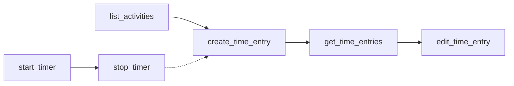

# create_time_entry

Create new time entries with flexible parameter combinations for precise time tracking.

## Summary {#summary}

The `create_time_entry` tool allows you to log time for specific activities in EARLY. It supports multiple ways to specify time ranges - you can provide specific start/end times, duration in minutes, or let the system default to current time.

**Key Features:**
- Flexible time specification (ranges, duration, or defaults)
- Automatic time entry replacement for identical slots
- Rich error handling with debug information
- Real-time integration with EARLY API v4

## Parameters {#parameters}

<table class="schema-table">
<thead>
<tr>
<th>Parameter</th>
<th>Type</th>
<th>Required</th>
<th>Description</th>
</tr>
</thead>
<tbody>
<tr>
<td><code>projectId</code></td>
<td>string</td>
<td><span class="param-required">Required</span></td>
<td>Activity ID from EARLY. Use <a href="list_activities.md"><code>list_activities</code></a> to get valid IDs.</td>
</tr>
<tr>
<td><code>description</code></td>
<td>string</td>
<td><span class="param-required">Required</span></td>
<td>Time entry description or note. Describes what you worked on.</td>
</tr>
<tr>
<td><code>startTime</code></td>
<td>string</td>
<td><span class="param-optional">Optional</span></td>
<td>Start time as ISO 8601 timestamp (e.g., <code>2025-10-14T08:00:00Z</code>)</td>
</tr>
<tr>
<td><code>endTime</code></td>
<td>string</td>
<td><span class="param-optional">Optional</span></td>
<td>End time as ISO 8601 timestamp (e.g., <code>2025-10-14T09:00:00Z</code>)</td>
</tr>
<tr>
<td><code>duration</code></td>
<td>number</td>
<td><span class="param-optional">Optional</span></td>
<td>Duration in minutes. Creates entry ending now, starting X minutes ago.</td>
</tr>
</tbody>
</table>

## Parameter Combinations {#combinations}

You can use these parameter combinations to create time entries:

### 1. Specific Time Range
Provide both `startTime` and `endTime` for precise time entries:

```json title="Specific Time Range"
{
  "projectId": "935607",
  "description": "Meeting with client", 
  "startTime": "2025-10-14T08:00:00Z",
  "endTime": "2025-10-14T09:00:00Z"
}
```

### 2. Duration-Based (Ends Now)
Use `duration` to create an entry that ends at the current time:

```json title="Duration-Based Entry"
{
  "projectId": "935607",
  "description": "Code review",
  "duration": 45
}
```

### 3. Start Time Only
Provide only `startTime` (creates entry starting then, ending now):

```json title="Start Time Only"
{
  "projectId": "935607", 
  "description": "Development work",
  "startTime": "2025-10-14T10:00:00Z"
}
```

### 4. Minimal (Current Time)
Just activity and description (creates entry starting and ending now):

```json title="Current Time Entry"
{
  "projectId": "935607",
  "description": "Quick note"
}
```

!!! warning "API Requirement"
    The EARLY API requires both start AND end times for all time entries. The server automatically calculates missing times based on your parameters.

## Behavior {#behavior}

### Time Entry Creation Process

1. **Parameter Validation**: Checks required fields and parameter combinations
2. **Authentication**: Verifies API credentials with EARLY
3. **Time Calculation**: Computes start/end times based on provided parameters  
4. **API Call**: Creates the time entry via EARLY API v4
5. **Response Formatting**: Returns formatted time entry details

### Automatic Time Slot Replacement

!!! info "Time Slot Behavior"
    EARLY automatically replaces time entries that have identical time slots and activities. This prevents duplicate entries but means existing entries may be overwritten.

### Time Format Handling

- **Input**: Accepts ISO 8601 timestamps with 'Z' suffix
- **Internal**: Converts to EARLY API format (removes 'Z' suffix)
- **Output**: Returns local formatted times in response

## Examples {#examples}

### Meeting Log

Log a client meeting that happened earlier:

```json title="Client Meeting"
{
  "projectId": "proj_client_work_123",
  "description": "Project kickoff meeting with stakeholders",
  "startTime": "2025-10-14T14:00:00Z", 
  "endTime": "2025-10-14T15:30:00Z"
}
```

**Response:**
```
Time entry created successfully!

Details:
- Activity: Client Work
- Description: Project kickoff meeting with stakeholders  
- Start: 2:00 PM
- End: 3:30 PM
- Duration: 1h 30m
- ID: te_abc123
```

### Quick Development Session

Log time you just finished working:

```json title="Development Session"
{
  "projectId": "proj_dev_456", 
  "description": "Bug fixes for user authentication",
  "duration": 120
}
```

**Response:**
```
Time entry created successfully!

Details:
- Activity: Development
- Description: Bug fixes for user authentication
- Start: 11:00 AM  
- End: 1:00 PM (now)
- Duration: 2h 0m
- ID: te_def456
```

### Administrative Task

Simple entry for a quick task:

```json title="Admin Task" 
{
  "projectId": "proj_admin_789",
  "description": "Team standup meeting"
}
```

## Error Scenarios {#errors}

### Common Errors and Solutions

| Error | Cause | Solution |
|-------|-------|----------|
| "Activity ID is required" | Missing `projectId` | Provide valid activity ID from `list_activities` |
| "Description is required" | Missing `description` | Add time entry description |
| "Authentication failed" | Invalid API credentials | Check `EARLY_API_KEY` and `EARLY_API_SECRET` |
| "Activity not found" | Invalid `projectId` | Use `list_activities` to get valid activity IDs |

### Example Error Response

```json title="Error Response"
{
  "content": [{
    "type": "text",
    "text": "Operation failed: Activity not found\n\nDebug info:\n- API Key: Present\n- API Secret: Present\n- Base URL: https://api.early.app\n\nProvided arguments: {\"projectId\": \"invalid_id\", \"description\": \"test\"}"
  }]
}
```

## Related Tools {#related}

### Complementary Functionality

- **[`list_activities`](list_activities.md)** - Get valid `projectId` values
- **[`get_time_entries`](get_time_entries.md)** - Review created entries
- **[`edit_time_entry`](edit_time_entry.md)** - Modify entries after creation
- **[`start_timer`](start_timer.md)** / **[`stop_timer`](stop_timer.md)** - Alternative real-time approach

### Workflow Integration



**Sequential Workflow:**
1. `list_activities` → Get activity IDs
2. `create_time_entry` → Log time 
3. `get_time_entries` → Review entries
4. `edit_time_entry` → Make corrections

**Alternative Timer Workflow:**
1. `start_timer` → Begin real-time tracking
2. `stop_timer` → End tracking (creates entry automatically)
3. Use `create_time_entry` for additional manual entries

## Best Practices {#best-practices}

### Time Entry Accuracy
- Use specific time ranges for precise tracking
- Include descriptive notes for better time analysis
- Verify activity IDs with `list_activities` first

### Batch Entry Creation
- For multiple entries, call sequentially with different time ranges
- Avoid overlapping time slots to prevent unwanted replacements
- Consider using timer workflow for active time tracking

### Error Handling
- Always check API credentials if authentication fails
- Validate activity IDs exist before creating entries
- Use debug information in error responses for troubleshooting