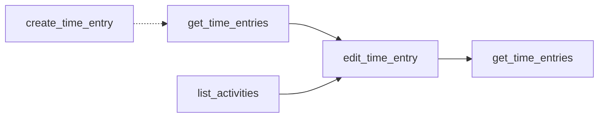

# edit_time_entry

Modify existing time entries with flexible field updates for precise time tracking corrections.

## Summary {#summary}

The `edit_time_entry` tool allows you to update any aspect of an existing time entry in EARLY. You can change the start/end times, switch to a different activity, update the description, or modify any combination of these fields.

**Key Features:**
- Update any field individually or in combination
- Flexible time modification (start time, end time, or both)
- Activity reassignment to different projects
- Description updates for better tracking accuracy
- Real-time integration with EARLY API v4

## Parameters {#parameters}

<table class="schema-table">
<thead>
<tr>
<th>Parameter</th>
<th>Type</th>
<th>Required</th>
<th>Description</th>
</tr>
</thead>
<tbody>
<tr>
<td><code>timeEntryId</code></td>
<td>string</td>
<td><span class="param-required">Required</span></td>
<td>ID of the time entry to edit. Get from <a href="get_time_entries.md"><code>get_time_entries</code></a> response.</td>
</tr>
<tr>
<td><code>startTime</code></td>
<td>string</td>
<td><span class="param-optional">Optional</span></td>
<td>New start time as ISO 8601 timestamp (e.g., <code>2025-10-14T08:00:00Z</code>)</td>
</tr>
<tr>
<td><code>endTime</code></td>
<td>string</td>
<td><span class="param-optional">Optional</span></td>
<td>New end time as ISO 8601 timestamp (e.g., <code>2025-10-14T09:00:00Z</code>)</td>
</tr>
<tr>
<td><code>activityId</code></td>
<td>string</td>
<td><span class="param-optional">Optional</span></td>
<td>New activity ID to reassign time entry. Use <a href="list_activities.md"><code>list_activities</code></a> to get valid IDs.</td>
</tr>
<tr>
<td><code>description</code></td>
<td>string</td>
<td><span class="param-optional">Optional</span></td>
<td>New description/note for the time entry. Replaces existing description.</td>
</tr>
</tbody>
</table>

!!! warning "At Least One Field Required"
    You must provide at least one optional parameter to update. The tool will return an error if only `timeEntryId` is provided.

## Update Patterns {#patterns}

### 1. Time Adjustment
Update just the timing without changing activity or description:

```json title="Time Range Adjustment"
{
  "timeEntryId": "te_abc123",
  "startTime": "2025-10-14T09:00:00Z",
  "endTime": "2025-10-14T10:30:00Z"
}
```

### 2. Activity Reassignment  
Move time entry to a different project/activity:

```json title="Project Change"
{
  "timeEntryId": "te_abc123",
  "activityId": "proj_new_project_456"
}
```

### 3. Description Update
Improve or correct the time entry description:

```json title="Description Update"
{
  "timeEntryId": "te_abc123",
  "description": "Updated: Client meeting and project planning session"
}
```

### 4. Comprehensive Update
Change multiple fields simultaneously:

```json title="Multi-field Update"
{
  "timeEntryId": "te_abc123",
  "startTime": "2025-10-14T14:00:00Z",
  "endTime": "2025-10-14T16:00:00Z", 
  "activityId": "proj_client_work_789",
  "description": "Extended client consultation and requirements gathering"
}
```

## Behavior {#behavior}

### Update Process

1. **Entry Validation**: Verifies the time entry exists and is accessible
2. **Parameter Validation**: Checks that at least one update field is provided  
3. **Authentication**: Confirms API credentials with EARLY
4. **Field Updates**: Applies changes to specified fields only
5. **API Synchronization**: Updates the entry via EARLY API v4
6. **Response Confirmation**: Returns updated entry details

### Field Update Logic

- **Partial Updates**: Only specified fields are modified
- **Unchanged Fields**: Non-specified fields retain their original values
- **Time Validation**: Start time must be before end time if both are updated
- **Activity Validation**: New activity ID must exist and be accessible

### Time Entry Identification

To get time entry IDs for editing:

1. Use [`get_time_entries`](get_time_entries.md) to list recent entries
2. Note the `id` field in the response
3. Use that ID in the `timeEntryId` parameter

## Examples {#examples}

### Extend Meeting Duration

A meeting ran longer than originally logged:

```json title="Extend End Time"
{
  "timeEntryId": "te_meeting_123",
  "endTime": "2025-10-14T11:30:00Z"
}
```

**Response:**
```
Time entry updated successfully:

ID: te_meeting_123
Updated fields: endTime

Entry details:
{
  "id": "te_meeting_123",
  "activity": {
    "name": "Client Work",
    "id": "proj_client_456"
  },
  "duration": {
    "startedAt": "2025-10-14T10:00:00",
    "stoppedAt": "2025-10-14T11:30:00"
  },
  "note": {
    "text": "Weekly client check-in"
  }
}
```

### Fix Incorrect Project Assignment

Time was logged to the wrong project:

```json title="Project Correction"
{
  "timeEntryId": "te_wrongproject_456", 
  "activityId": "proj_correct_789",
  "description": "Development work - moved from wrong project"
}
```

### Comprehensive Meeting Update

Update all details of a meeting entry:

```json title="Complete Meeting Update"
{
  "timeEntryId": "te_meeting_789",
  "startTime": "2025-10-14T09:30:00Z",
  "endTime": "2025-10-14T11:00:00Z",
  "activityId": "proj_strategy_planning",
  "description": "Q4 strategy planning session with leadership team"
}
```

### Adjust Start Time Only

Meeting started 15 minutes late:

```json title="Start Time Adjustment"
{
  "timeEntryId": "te_standup_123",
  "startTime": "2025-10-14T09:15:00Z"
}
```

## Common Use Cases {#use-cases}

### Time Corrections
- **Meeting overruns**: Extend end time when meetings run long
- **Late starts**: Adjust start time for delayed beginnings
- **Break adjustments**: Modify times to account for breaks

### Project Management
- **Task reassignment**: Move time entries between projects
- **Client billing**: Ensure time is assigned to correct billable activities
- **Category corrections**: Fix misclassified time entries

### Documentation Improvements
- **Detail additions**: Enhance descriptions with more context
- **Clarity improvements**: Make notes more specific for reporting
- **Standardization**: Align descriptions with team conventions

## Error Scenarios {#errors}

### Common Errors and Solutions

| Error | Cause | Solution |
|-------|-------|----------|
| "Time entry ID is required" | Missing `timeEntryId` | Provide valid time entry ID from `get_time_entries` |
| "At least one field must be provided" | Only `timeEntryId` provided | Include at least one update parameter |
| "Time entry not found" | Invalid `timeEntryId` | Verify ID exists using `get_time_entries` |
| "Activity not found" | Invalid `activityId` | Use `list_activities` to get valid activity IDs |
| "Authentication failed" | Invalid API credentials | Check `EARLY_API_KEY` and `EARLY_API_SECRET` |

### Example Error Response

```json title="Missing Updates Error"
{
  "content": [{
    "type": "text",
    "text": "Operation failed: At least one field must be provided to update\n\nDebug info:\n- API Key: Present\n- API Secret: Present\n- Base URL: https://api.early.app\n\nProvided arguments: {\"timeEntryId\": \"te_123\"}"
  }]
}
```

## Related Tools {#related}

### Complementary Functionality

- **[`get_time_entries`](get_time_entries.md)** - Get time entry IDs and current values
- **[`create_time_entry`](create_time_entry.md)** - Create new entries instead of editing
- **[`list_activities`](list_activities.md)** - Get valid activity IDs for reassignment
- **[`start_timer`](start_timer.md)** / **[`stop_timer`](stop_timer.md)** - Real-time tracking alternative

### Workflow Integration



**Typical Editing Workflow:**
1. `get_time_entries` → Find entries to modify
2. `list_activities` → Get valid activity IDs (if reassigning)
3. `edit_time_entry` → Apply updates
4. `get_time_entries` → Verify changes

## Best Practices {#best-practices}

### Before Editing
- Always use `get_time_entries` to get current entry details
- Verify time entry IDs are correct and entries exist
- Check that new activity IDs are valid with `list_activities`

### Time Modifications
- Ensure start time is before end time when updating both
- Consider time zone implications for timestamp updates
- Validate that time ranges don't create impossible durations

### Batch Updates
- Edit entries individually rather than attempting bulk operations  
- Maintain audit trail by updating descriptions to note changes
- Consider creating new entries instead of editing if changes are major

### Error Prevention
- Always provide at least one field to update beyond `timeEntryId`
- Double-check activity IDs before reassigning time entries
- Use descriptive error messages to troubleshoot authentication issues