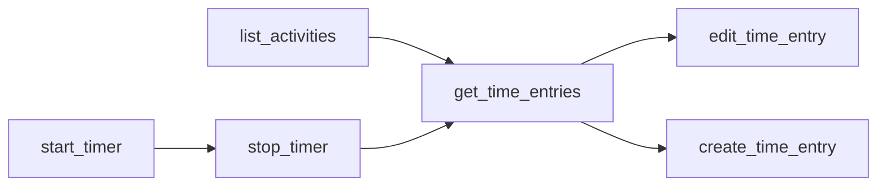

# get_time_entries

Query time entries with flexible date ranges and filtering options for comprehensive time analysis.

## Summary {#summary}

The `get_time_entries` tool allows you to retrieve time entries from EARLY based on date ranges and activity filters. It's essential for reviewing logged time, generating reports, and finding specific entries for editing or analysis.

**Key Features:**
- Flexible date range queries (today, specific dates, or date ranges)
- Activity-based filtering for project-specific analysis
- Formatted time display with local time conversion
- Comprehensive entry details including activity names and durations
- Real-time integration with EARLY API v4

## Parameters {#parameters}

<table class="schema-table">
<thead>
<tr>
<th>Parameter</th>
<th>Type</th>
<th>Required</th>
<th>Description</th>
</tr>
</thead>
<tbody>
<tr>
<td><code>startDate</code></td>
<td>string</td>
<td><span class="param-optional">Optional</span></td>
<td>Start date for range query in YYYY-MM-DD format (e.g., <code>2025-10-14</code>)</td>
</tr>
<tr>
<td><code>endDate</code></td>
<td>string</td>
<td><span class="param-optional">Optional</span></td>
<td>End date for range query in YYYY-MM-DD format (e.g., <code>2025-10-20</code>)</td>
</tr>
<tr>
<td><code>projectId</code></td>
<td>string</td>
<td><span class="param-optional">Optional</span></td>
<td>Filter by specific activity ID. Use <a href="list_activities.md"><code>list_activities</code></a> to get valid IDs.</td>
</tr>
</tbody>
</table>

!!! info "Default Behavior"
    If no parameters are provided, the tool returns today's time entries.

## Query Patterns {#patterns}

### 1. Today's Entries (Default)
Get all time entries for today:

```json title="Today's Time Entries"
{
  // No parameters = today's entries
}
```

### 2. Specific Date
Get entries for a particular date:

```json title="Specific Date Query"
{
  "startDate": "2025-10-14",
  "endDate": "2025-10-14"
}
```

### 3. Date Range
Query entries across multiple days:

```json title="Week Range Query"
{
  "startDate": "2025-10-14", 
  "endDate": "2025-10-20"
}
```

### 4. Project-Specific Entries
Filter by specific activity/project:

```json title="Project Filter"
{
  "startDate": "2025-10-01",
  "endDate": "2025-10-31",
  "projectId": "proj_client_work_123"
}
```

### 5. Today's Project Work
Combine today's entries with project filtering:

```json title="Today's Project Time"
{
  "projectId": "proj_development_456"
  // No dates = today + project filter
}
```

## Behavior {#behavior}

### Query Process

1. **Parameter Processing**: Determines query scope (today vs. date range)
2. **Date Conversion**: Converts dates to EARLY API timestamp format
3. **Authentication**: Verifies API credentials with EARLY
4. **API Query**: Retrieves entries via EARLY API v4
5. **Response Formatting**: Formats times and creates readable output

### Date Range Logic

- **No dates**: Returns today's entries (00:00:00 to 23:59:59)
- **Start + End dates**: Returns entries within the specified range
- **Project filter**: Applied to whatever date range is specified
- **Time zones**: Automatically handles local time conversion

### Response Format

Each time entry includes:
- **Activity name** and ID
- **Formatted start/end times** (local timezone)
- **Duration** in human-readable format
- **Description/notes** from the time entry
- **Entry ID** for use with [`edit_time_entry`](edit_time_entry.md)

## Examples {#examples}

### Today's Time Review

Check all time entries for today:

```json title="Today's Entries"
{}
```

**Response:**
```
Found 3 time entries:

1. Development: 9:00 AM - 11:30 AM (2h 30m)
2. Client Meeting: 2:00 PM - 3:00 PM (1h 0m)  
3. Email & Admin: 3:30 PM - 4:00 PM (30m)
```

### Weekly Project Analysis

Review a specific project for the past week:

```json title="Weekly Project Review"
{
  "startDate": "2025-10-07",
  "endDate": "2025-10-13", 
  "projectId": "proj_website_redesign"
}
```

**Response:**
```
Found 8 time entries:

1. Website Redesign: 10/07 9:00 AM - 12:00 PM (3h 0m)
2. Website Redesign: 10/07 2:00 PM - 4:30 PM (2h 30m)
3. Website Redesign: 10/08 10:00 AM - 11:45 AM (1h 45m)
4. Website Redesign: 10/09 9:30 AM - 12:30 PM (3h 0m)
5. Website Redesign: 10/10 8:00 AM - 10:00 AM (2h 0m)
6. Website Redesign: 10/11 1:00 PM - 3:15 PM (2h 15m)
7. Website Redesign: 10/12 9:00 AM - 11:00 AM (2h 0m)
8. Website Redesign: 10/13 3:00 PM - 5:30 PM (2h 30m)
```

### Monthly Time Audit

Review all time for billing purposes:

```json title="Monthly Billing Review"
{
  "startDate": "2025-10-01",
  "endDate": "2025-10-31"
}
```

### Find Recent Entries for Editing

Get recent entries to find IDs for editing:

```json title="Recent Entries for Editing"
{
  "startDate": "2025-10-13",
  "endDate": "2025-10-14"
}
```

## Common Use Cases {#use-cases}

### Daily Time Review
- **Morning planning**: Check yesterday's entries for context
- **End of day**: Review today's logged time for accuracy
- **Quick checks**: Verify recent timer sessions were captured

### Project Time Analysis
- **Client billing**: Calculate billable hours by project
- **Project progress**: Track time investment in specific initiatives
- **Resource allocation**: Understand time distribution across activities

### Time Entry Management
- **Find entries to edit**: Get entry IDs for corrections
- **Duplicate detection**: Identify potentially overlapping entries
- **Missing time identification**: Spot gaps in time tracking

### Reporting and Analytics
- **Weekly summaries**: Generate time reports for specific periods
- **Productivity analysis**: Review time patterns and efficiency
- **Client reporting**: Extract project-specific time data

## Error Scenarios {#errors}

### Common Errors and Solutions

| Error | Cause | Solution |
|-------|-------|----------|
| "Authentication failed" | Invalid API credentials | Check `EARLY_API_KEY` and `EARLY_API_SECRET` |
| "Invalid date format" | Incorrect date format | Use YYYY-MM-DD format (e.g., `2025-10-14`) |
| "Activity not found" | Invalid `projectId` | Use `list_activities` to get valid activity IDs |
| "Start date after end date" | Date range logic error | Ensure `startDate` is before or equal to `endDate` |

### Example Error Response

```json title="Authentication Error"
{
  "content": [{
    "type": "text",
    "text": "Operation failed: Authentication failed\n\nDebug info:\n- API Key: Missing\n- API Secret: Present\n- Base URL: https://api.early.app\n\nProvided arguments: {\"startDate\": \"2025-10-14\"}"
  }]
}
```

## Related Tools {#related}

### Complementary Functionality

- **[`create_time_entry`](create_time_entry.md)** - Create entries for missing time periods
- **[`edit_time_entry`](edit_time_entry.md)** - Modify entries found in query results
- **[`list_activities`](list_activities.md)** - Get valid `projectId` values for filtering
- **[`start_timer`](start_timer.md)** / **[`stop_timer`](stop_timer.md)** - Real-time tracking to generate entries

### Workflow Integration



**Common Workflows:**

**Time Review & Correction:**
1. `get_time_entries` → Review recent time
2. `edit_time_entry` → Fix any inaccuracies
3. `create_time_entry` → Add missing time periods

**Project Analysis:**
1. `list_activities` → Get project IDs
2. `get_time_entries` → Query project-specific time
3. Analyze time distribution and patterns

## Best Practices {#best-practices}

### Effective Querying
- **Start broad**: Begin with larger date ranges, then narrow down
- **Use project filters**: Focus on specific activities for detailed analysis
- **Regular reviews**: Check entries daily for accuracy

### Date Range Selection
- **Logical ranges**: Use weekly, monthly, or billing period boundaries  
- **Avoid massive ranges**: Large date ranges may return overwhelming results
- **Consider time zones**: Remember that dates are processed in local time

### Data Usage
- **Note entry IDs**: Save IDs from responses for later editing
- **Track patterns**: Look for time tracking consistency and gaps
- **Validate totals**: Cross-check durations with expected work hours

### Performance Considerations
- **Reasonable ranges**: Avoid querying years of data at once
- **Specific filters**: Use project filters to reduce result size
- **Batch processing**: Query smaller chunks for large-scale analysis