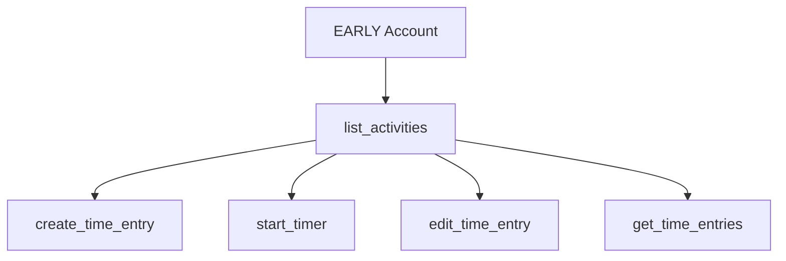

# list_activities

Get all activities from EARLY with optional filtering for project management and time tracking setup.

## Summary {#summary}

The `list_activities` tool retrieves all activities (projects/tasks) from your EARLY account. It's essential for discovering valid activity IDs needed by other tools like [`create_time_entry`](create_time_entry.md) and [`start_timer`](start_timer.md).

**Key Features:**
- Retrieve all activities from your EARLY account
- Optional filtering for active activities only
- Activity details including names and IDs
- Real-time integration with EARLY API v4
- Foundation tool for all time tracking operations

## Parameters {#parameters}

<table class="schema-table">
<thead>
<tr>
<th>Parameter</th>
<th>Type</th>
<th>Required</th>
<th>Description</th>
</tr>
</thead>
<tbody>
<tr>
<td><code>active</code></td>
<td>boolean</td>
<td><span class="param-optional">Optional</span></td>
<td>Filter to show only active activities. Default: <code>false</code> (shows all activities)</td>
</tr>
</tbody>
</table>

!!! info "Default Behavior"
    If no parameters are provided, returns all activities including active, inactive, and archived ones.

## Query Options {#options}

### 1. All Activities (Default)
Get complete list of all activities:

```json title="All Activities"
{
  // No parameters = all activities
}
```

### 2. Active Activities Only
Filter to show only currently active activities:

```json title="Active Activities Filter"
{
  "active": true
}
```

### 3. All Activities (Explicit)
Explicitly request all activities:

```json title="All Activities Explicit"
{
  "active": false
}
```

## Behavior {#behavior}

### Activity Retrieval Process

1. **Authentication**: Verifies API credentials with EARLY
2. **Query Execution**: Requests activities via EARLY API v4
3. **Filtering**: Applies active/inactive filter if specified
4. **Response Formatting**: Creates readable list with names and IDs

### Activity Types

EARLY typically includes these activity categories:
- **Active Activities**: Currently available for time tracking
- **Inactive Activities**: Temporarily disabled but not deleted
- **Archived Activities**: Completed projects kept for historical reference

### Response Format

Each activity includes:
- **Activity Name**: Human-readable project/task name
- **Activity ID**: Unique identifier for use in other tools
- **Status**: Whether the activity is active, inactive, or archived

## Examples {#examples}

### Get All Activities for Setup

When first setting up time tracking:

```json title="Complete Activity List"
{}
```

**Response:**
```
Activities (all activities): 8 found

1. Client Work - Website Project (ID: proj_client_web_123)
2. Internal Development (ID: proj_internal_dev_456) 
3. Administrative Tasks (ID: proj_admin_789)
4. Marketing Campaigns (ID: proj_marketing_012)
5. Research & Development (ID: proj_rd_345)
6. Training & Learning (ID: proj_training_678)
7. [ARCHIVED] Old Client Project (ID: proj_old_client_901)
8. [INACTIVE] Paused Initiative (ID: proj_paused_234)
```

### Get Active Activities for Daily Use

For regular time tracking workflow:

```json title="Active Activities Only"
{
  "active": true
}
```

**Response:**
```
Activities (active only): 6 found

1. Client Work - Website Project (ID: proj_client_web_123)
2. Internal Development (ID: proj_internal_dev_456)
3. Administrative Tasks (ID: proj_admin_789)
4. Marketing Campaigns (ID: proj_marketing_012)
5. Research & Development (ID: proj_rd_345)
6. Training & Learning (ID: proj_training_678)
```

### Quick ID Reference

Finding a specific project ID:

```json title="Find Specific Project"
{
  "active": true
}
```

Look for the project name in the response and note its ID for use in other tools.

## Common Use Cases {#use-cases}

### Initial Setup
- **First-time use**: Discover all available activities in your EARLY account
- **Project overview**: Understand what projects are available for time tracking
- **ID collection**: Gather activity IDs for configuration or automation

### Daily Time Tracking
- **Quick reference**: Get active project list for timer operations
- **Project selection**: Choose which activity to track time against
- **Validation**: Verify activity still exists before creating time entries

### Project Management
- **Status review**: See which activities are active vs. archived
- **Project inventory**: Understand full scope of tracked projects
- **Historical reference**: Access archived projects for reporting

### Integration Setup
- **MCP client configuration**: Get activity IDs for automated workflows
- **Script development**: Collect IDs for time tracking automation
- **API integration**: Validate available activities for external systems

## Error Scenarios {#errors}

### Common Errors and Solutions

| Error | Cause | Solution |
|-------|-------|----------|
| "Authentication failed" | Invalid API credentials | Check `EARLY_API_KEY` and `EARLY_API_SECRET` |
| "No activities found" | Empty EARLY account | Create activities in EARLY app first |
| "Connection timeout" | Network issues | Check internet connection and EARLY API availability |
| "Invalid parameter" | Wrong parameter type | Ensure `active` is boolean (`true` or `false`) |

### Example Error Response

```json title="Authentication Error"
{
  "content": [{
    "type": "text",
    "text": "❌ Operation failed: Authentication failed\n\nDebug info:\n- API Key: Present\n- API Secret: Missing\n- Base URL: https://api.early.app\n\nProvided arguments: {\"active\": true}"
  }]
}
```

### No Activities Scenario

```json title="Empty Activities Response"
{
  "content": [{
    "type": "text", 
    "text": "Activities (active only): 0 found\n\n"
  }]
}
```

## Related Tools {#related}

### Essential for These Tools

`list_activities` provides the activity IDs required by:

- **[`create_time_entry`](create_time_entry.md)** - Requires valid `projectId`
- **[`start_timer`](start_timer.md)** - Requires valid `projectId` 
- **[`edit_time_entry`](edit_time_entry.md)** - May need `activityId` for reassignment
- **[`get_time_entries`](get_time_entries.md)** - Can filter by `projectId`

### Workflow Integration



**Typical Workflows:**

**Setup Workflow:**
1. `list_activities` → Discover available projects
2. Choose activities for time tracking
3. Use activity IDs in time tracking tools

**Daily Tracking:**
1. `list_activities` (active only) → Get current projects
2. `start_timer` with chosen activity ID
3. Continue with timer or entry creation tools

## Best Practices {#best-practices}

### Initial Discovery
- **Start with all activities**: Use default parameters to see full scope
- **Note active vs. inactive**: Understand project status in your account  
- **Save commonly used IDs**: Keep reference list of frequently used activity IDs

### Regular Usage
- **Use active filter**: Filter to active activities for daily workflow
- **Refresh periodically**: Re-run to catch newly created activities
- **Validate before use**: Check activities exist before using IDs in other tools

### Activity Management
- **Understand naming**: Note how activities are named in your EARLY setup
- **Track changes**: Monitor when activities become inactive or archived
- **Coordinate with team**: Ensure everyone uses consistent activity names/IDs

### Performance Optimization
- **Cache results**: Store activity list locally for repeated use
- **Filter appropriately**: Use active filter when archived projects aren't needed
- **Combine with other tools**: Chain with time tracking operations efficiently

## Integration Notes {#integration}

### Claude Desktop Usage
You can ask Claude naturally:
```
"What projects can I track time for?"
"Show me my active activities"
"List all my EARLY projects"
```

### API Integration
The response format makes it easy to:
- Parse activity names and IDs programmatically
- Build dropdown lists for user interfaces
- Validate activity existence in automated workflows

### Activity ID Format
- Activity IDs are typically strings like `"proj_client_web_123"`
- IDs are stable and don't change when activity names are updated
- Always use IDs (not names) in other tool parameters for reliability