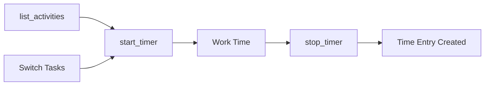
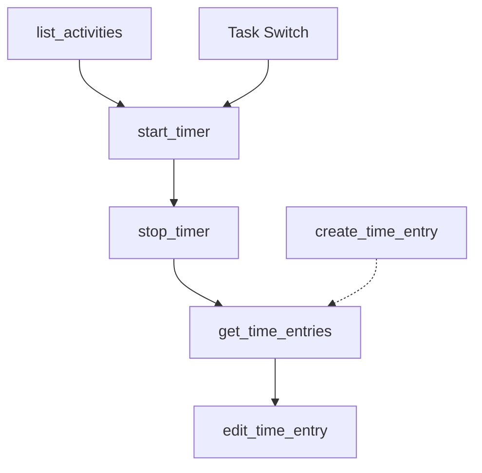

# start_timer

Start real-time time tracking for an activity with automatic time entry creation when stopped.

## Summary {#summary}

The `start_timer` tool begins active time tracking for a specific activity in EARLY. Unlike creating time entries retroactively, this starts a live timer that runs until you stop it with [`stop_timer`](stop_timer.md). When stopped, it automatically creates a time entry for the tracked period.

**Key Features:**
- Real-time time tracking with live timer
- Automatic time entry creation when timer is stopped
- Optional task description for better tracking context
- Integration with EARLY's native timer functionality
- Seamless workflow with [`stop_timer`](stop_timer.md)

## Parameters {#parameters}

<table class="schema-table">
<thead>
<tr>
<th>Parameter</th>
<th>Type</th>
<th>Required</th>
<th>Description</th>
</tr>
</thead>
<tbody>
<tr>
<td><code>projectId</code></td>
<td>string</td>
<td><span class="param-required">Required</span></td>
<td>Activity ID to track time for. Use <a href="list_activities.md"><code>list_activities</code></a> to get valid IDs.</td>
</tr>
<tr>
<td><code>description</code></td>
<td>string</td>
<td><span class="param-optional">Optional</span></td>
<td>Task description or note for this tracking session. Helps with context and reporting.</td>
</tr>
</tbody>
</table>

!!! warning "One Timer at a Time"
    EARLY allows only one active timer at a time. Starting a new timer will stop any currently running timer.

## Usage Patterns {#patterns}

### 1. Basic Timer Start
Start timer with just the activity:

```json title="Simple Timer Start"
{
  "projectId": "proj_development_123"
}
```

### 2. Timer with Description
Start timer with task context:

```json title="Timer with Context"
{
  "projectId": "proj_client_work_456",
  "description": "Working on login functionality"
}
```

### 3. Meeting Timer
Start timer for a meeting:

```json title="Meeting Timer"
{
  "projectId": "proj_client_meetings_789",
  "description": "Weekly client check-in and project review"
}
```

## Behavior {#behavior}

### Timer Start Process

1. **Activity Validation**: Verifies the activity ID exists and is accessible
2. **Current Timer Check**: Checks for any running timers (will stop existing ones)
3. **Authentication**: Confirms API credentials with EARLY
4. **Timer Initialization**: Starts the timer via EARLY API v4
5. **Response Confirmation**: Returns timer details and start confirmation

### Timer State Management

- **Single Active Timer**: Only one timer can run at a time
- **Automatic Stop**: Starting a new timer automatically stops the previous one
- **Persistent State**: Timer continues running until explicitly stopped
- **Cross-Platform**: Timer state is synchronized across all EARLY clients

### Time Entry Generation

When the timer is stopped with [`stop_timer`](stop_timer.md):
- Automatically creates a time entry for the tracked period
- Uses the description provided when starting the timer
- Calculates duration from start time to stop time
- Integrates with EARLY's time tracking history

## Examples {#examples}

### Start Development Work

Begin tracking development time:

```json title="Development Session"
{
  "projectId": "proj_web_development_123",
  "description": "Implementing user authentication system"
}
```

**Response:**
```
⏱️ Timer started successfully!

Details:
- Activity: Web Development
- Description: Implementing user authentication system
- Started: Now
- ID: timer_abc123

Timer is now running...
```

### Quick Administrative Task

Start timer for admin work without description:

```json title="Admin Timer"
{
  "projectId": "proj_admin_tasks_456"
}
```

**Response:**
```
⏱️ Timer started successfully!

Details:
- Activity: Administrative Tasks
- Description: No description
- Started: Now
- ID: timer_def456

Timer is now running...
```

### Client Meeting Timer

Track time for a client meeting:

```json title="Client Meeting"
{
  "projectId": "proj_client_consultation_789",
  "description": "Q4 planning session with stakeholder team"
}
```

**Response:**
```
⏱️ Timer started successfully!

Details:
- Activity: Client Consultation
- Description: Q4 planning session with stakeholder team
- Started: Now
- ID: timer_ghi789

Timer is now running...
```

## Timer Workflow {#workflow}

### Real-time Tracking Process



**Typical Timer Session:**
1. `list_activities` → Choose project to work on
2. `start_timer` → Begin tracking time
3. **Do the work** → Timer runs in background
4. `stop_timer` → End session and create time entry
5. Repeat for different tasks/projects

### Task Switching

When switching between tasks:
1. `start_timer` with new project ID (automatically stops previous timer)
2. Continue working on new task
3. `stop_timer` when done
4. Previous timer session is automatically saved as time entry

## Error Scenarios {#errors}

### Common Errors and Solutions

| Error | Cause | Solution |
|-------|-------|----------|
| "Activity ID is required" | Missing `projectId` | Provide valid activity ID from `list_activities` |
| "Activity not found" | Invalid `projectId` | Use `list_activities` to get valid activity IDs |
| "Authentication failed" | Invalid API credentials | Check `EARLY_API_KEY` and `EARLY_API_SECRET` |
| "Timer start failed" | API or network issues | Check connection and retry |

### Example Error Response

```json title="Missing Activity Error"
{
  "content": [{
    "type": "text",
    "text": "❌ Operation failed: Activity ID is required to start timer\n\nDebug info:\n- API Key: Present\n- API Secret: Present\n- Base URL: https://api.early.app\n\nProvided arguments: {\"description\": \"forgot activity id\"}"
  }]
}
```

### Invalid Activity Response

```json title="Activity Not Found"
{
  "content": [{
    "type": "text", 
    "text": "❌ Operation failed: Activity not found\n\nDebug info:\n- API Key: Present\n- API Secret: Present\n- Base URL: https://api.early.app\n\nProvided arguments: {\"projectId\": \"invalid_id\"}"
  }]
}
```

## Related Tools {#related}

### Essential Companion Tools

- **[`stop_timer`](stop_timer.md)** - **Required** to end timer sessions and create time entries
- **[`list_activities`](list_activities.md)** - **Required** to get valid `projectId` values
- **[`get_time_entries`](get_time_entries.md)** - Review time entries created from timer sessions
- **[`edit_time_entry`](edit_time_entry.md)** - Modify entries created from timer sessions

### Alternative Approaches

- **[`create_time_entry`](create_time_entry.md)** - Create time entries retroactively instead of real-time tracking

### Workflow Integration



**Timer-Based Workflow:**
1. `list_activities` → Get available projects
2. `start_timer` → Begin tracking
3. **Work on task** → Timer runs
4. `stop_timer` → Create time entry
5. `get_time_entries` → Review tracked time
6. `edit_time_entry` → Make corrections if needed

## Best Practices {#best-practices}

### Effective Timer Usage
- **Start immediately**: Begin timer when starting work, not when remembering to track
- **Use descriptions**: Add context to help with later analysis and reporting
- **Switch cleanly**: Start new timers for different tasks (auto-stops previous)
- **Stop consistently**: Always stop timers when switching tasks or finishing work

### Task Organization
- **One task per timer**: Don't mix different types of work in single timer session
- **Meaningful descriptions**: Use descriptions that will make sense later for reporting
- **Consistent activity usage**: Use the same activity IDs for similar types of work

### Time Tracking Discipline
- **Regular timer use**: Make timer starting a habit when beginning work
- **Break awareness**: Stop timers during breaks to maintain accuracy
- **End-of-day cleanup**: Ensure all timers are stopped before ending work day

### Integration with Workflow
- **Morning routine**: Start with `list_activities` to see available projects
- **Task switching**: Use timer starts as task transition markers  
- **Review habit**: Periodically check created time entries for accuracy

### Error Prevention
- **Validate activities**: Use `list_activities` to confirm valid project IDs
- **Check credentials**: Ensure API keys are properly configured
- **Network awareness**: Be mindful of connectivity when starting critical timers