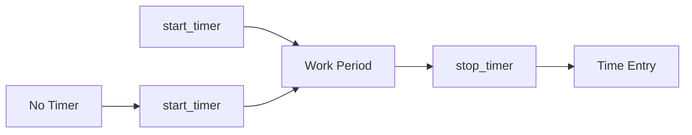
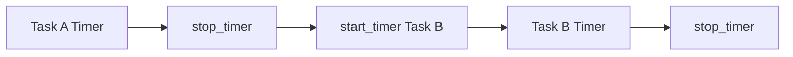
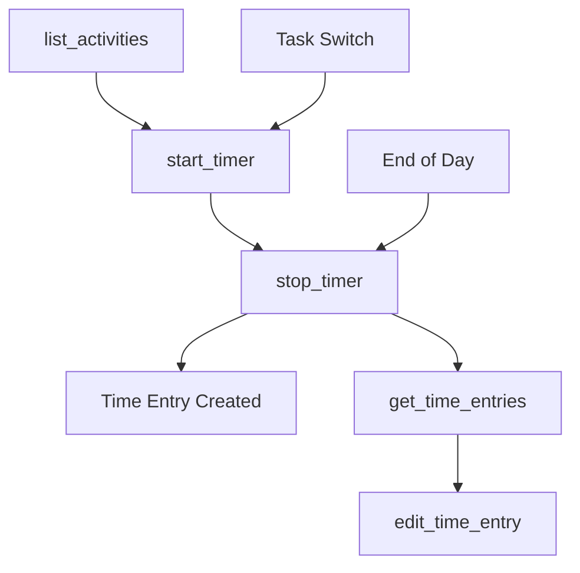

# stop_timer

Stop the currently running timer and automatically create a time entry for the tracked period.

## Summary {#summary}

The `stop_timer` tool ends any currently running timer in EARLY and automatically creates a time entry for the time that was tracked. This is the essential companion to [`start_timer`](start_timer.md) and completes the real-time time tracking workflow.

**Key Features:**
- Stops the currently active timer instantly
- Automatically creates a time entry for the tracked period
- No parameters needed - works with whatever timer is running
- Handles minimum time requirements and edge cases
- Provides detailed summary of the completed time session

## Parameters {#parameters}

<table class="schema-table">
<thead>
<tr>
<th>Parameter</th>
<th>Type</th>
<th>Required</th>
<th>Description</th>
</tr>
</thead>
<tbody>
<tr>
<td colspan="4" style="text-align: center; font-style: italic;">No parameters required</td>
</tr>
</tbody>
</table>

!!! info "Parameter-Free Operation"
    `stop_timer` requires no parameters. It automatically stops whatever timer is currently running and creates a time entry.

## Usage Patterns {#patterns}

### 1. Simple Timer Stop
Stop the current timer (most common usage):

```json title="Stop Current Timer"
{
  // No parameters needed
}
```

### 2. Empty Object (Alternative)
Some MCP clients require an empty object:

```json title="Empty Object Format"
{}
```

Both formats work identically and will stop the currently running timer.

## Behavior {#behavior}

### Timer Stop Process

1. **Active Timer Detection**: Checks for currently running timer
2. **Timer Validation**: Ensures timer has run for minimum required time
3. **Authentication**: Verifies API credentials with EARLY
4. **Timer Termination**: Stops the active timer via EARLY API v4
5. **Time Entry Creation**: Automatically creates time entry for the session
6. **Response Summary**: Returns details of the completed time session

### Time Entry Creation

When a timer is stopped:
- **Start Time**: Uses the time when [`start_timer`](start_timer.md) was called
- **End Time**: Uses the current time when `stop_timer` is called  
- **Duration**: Calculates the elapsed time between start and stop
- **Activity**: Uses the activity specified when starting the timer
- **Description**: Uses the description provided when starting the timer (if any)

### Minimum Time Requirements

EARLY has a minimum time requirement for timer sessions:
- **Minimum Duration**: Timers must run for at least 1 minute
- **Sub-minute Sessions**: Sessions under 1 minute are not saved as time entries
- **Graceful Handling**: Short sessions receive appropriate feedback

## Examples {#examples}

### Successful Timer Stop

After working for several hours:

```json title="Stop After Work Session"
{}
```

**Response:**
```
Timer stopped successfully!

Final Summary:
- Activity: Web Development  
- Description: Implementing user authentication system
- ID: timer_abc123

Time entry has been saved.
```

### Short Session Stop

Stopping a timer that ran for less than 1 minute:

```json title="Stop Short Session"
{}
```

**Response:**
```
Timer stopped.

Timer must run for at least 1 minute for the tracking to be saved.
```

### No Active Timer

Attempting to stop when no timer is running:

```json title="No Active Timer"
{}
```

**Response:**
```
No active timer found to stop.

There is currently no timer running. Use `start_timer` to begin tracking time for an activity.
```

## Timer Session Workflow {#workflow}

### Complete Tracking Session



**Full Timer Workflow:**
1. **[`start_timer`](start_timer.md)** → Begin tracking with activity and description
2. **Work Period** → Timer runs in background while you work
3. **`stop_timer`** → End tracking and create time entry
4. **Review** → Time entry appears in EARLY and can be queried with [`get_time_entries`](get_time_entries.md)

### Task Switching

When switching between different tasks:


**Task Switch Process:**
1. `stop_timer` → End current task timer
2. [`start_timer`](start_timer.md) → Begin new task timer  
3. Continue work → New timer tracks different activity
4. `stop_timer` → End when switching again or finishing work

## Error Scenarios {#errors}

### Common Scenarios and Responses

| Scenario | Response Type | Description |
|----------|---------------|-------------|
| **Timer stopped successfully** | Success | Timer ran for sufficient time and time entry was created |
| **Session too short** | Info | Timer stopped but session under 1 minute wasn't saved |
| **No active timer** | Warning | No timer currently running to stop |
| **Authentication failed** | Error | API credentials invalid or expired |
| **Network error** | Error | Connection issues with EARLY API |

### Example Error Responses

#### Authentication Error
```json title="API Authentication Failed"
{
  "content": [{
    "type": "text",
    "text": "Operation failed: Authentication failed\n\nDebug info:\n- API Key: Missing\n- API Secret: Present\n- Base URL: https://api.early.app"
  }]
}
```

#### No Active Timer
```json title="No Timer Running"
{
  "content": [{
    "type": "text",
    "text": "No active timer found to stop.\n\nThere is currently no timer running. Use `start_timer` to begin tracking time for an activity."
  }]
}
```

## Related Tools {#related}

### Essential Companion Tools

- **[`start_timer`](start_timer.md)** - **Required** to begin timer sessions before stopping them
- **[`list_activities`](list_activities.md)** - Get activity IDs for starting timers
- **[`get_time_entries`](get_time_entries.md)** - Review time entries created from timer sessions
- **[`edit_time_entry`](edit_time_entry.md)** - Modify entries created from completed timer sessions

### Alternative Approaches

- **[`create_time_entry`](create_time_entry.md)** - Create time entries manually instead of using timers

### Workflow Integration



**Timer-Based Time Tracking:**
1. **Setup**: `list_activities` → Get available projects
2. **Start Work**: `start_timer` → Begin real-time tracking
3. **Work Period**: Focus on task while timer runs
4. **End Session**: `stop_timer` → Create time entry automatically
5. **Review**: `get_time_entries` → Check tracked time
6. **Adjust**: `edit_time_entry` → Make corrections if needed

## Best Practices {#best-practices}

### Effective Timer Management
- **Stop immediately**: End timers as soon as you finish tasks or take breaks
- **Regular stops**: Don't let timers run overnight or during long breaks
- **Consistent workflow**: Make stopping timers part of your task completion routine
- **End-of-day cleanup**: Always stop active timers before ending work sessions

### Time Accuracy
- **Prompt stopping**: Stop timers when actually finishing work, not hours later
- **Break handling**: Stop timers during lunch breaks or long interruptions
- **Task boundaries**: Stop timers when switching to different types of work
- **Meeting transitions**: Stop project timers when switching to meetings

### Session Management
- **Meaningful durations**: Ensure timer sessions represent actual work periods
- **Avoid micro-sessions**: Don't start and immediately stop timers (under 1 minute)
- **Context preservation**: Remember what you were working on when reviewing stopped timers
- **Review habits**: Check created time entries for accuracy after stopping

### Integration with Daily Workflow
- **Task completion**: Use timer stops as natural task completion markers
- **Status updates**: Stop timers when providing project status updates  
- **Transition rituals**: Make timer stopping part of task switching routine
- **Daily review**: Stop all timers before reviewing daily time tracking

### Error Prevention and Recovery
- **Check for active timers**: Verify timer state before starting new work sessions
- **Handle short sessions**: Be aware that very short timer sessions aren't saved
- **Network awareness**: Ensure stable connection when stopping important timers
- **Credential maintenance**: Keep API credentials valid for successful timer operations